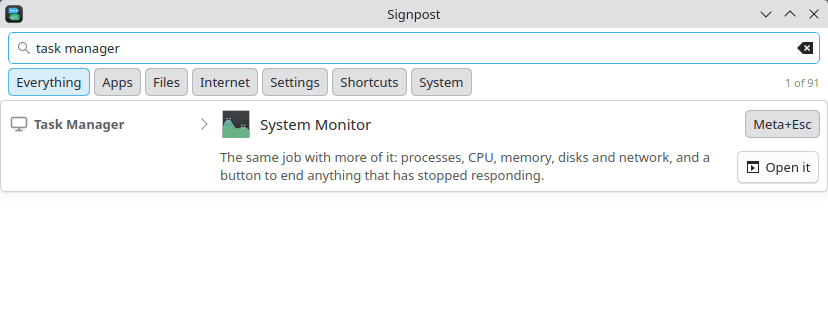
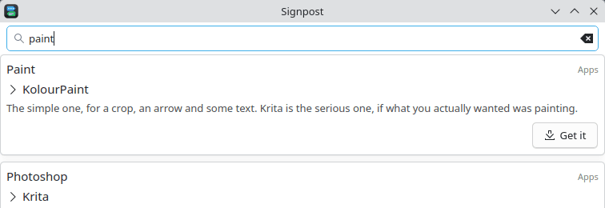
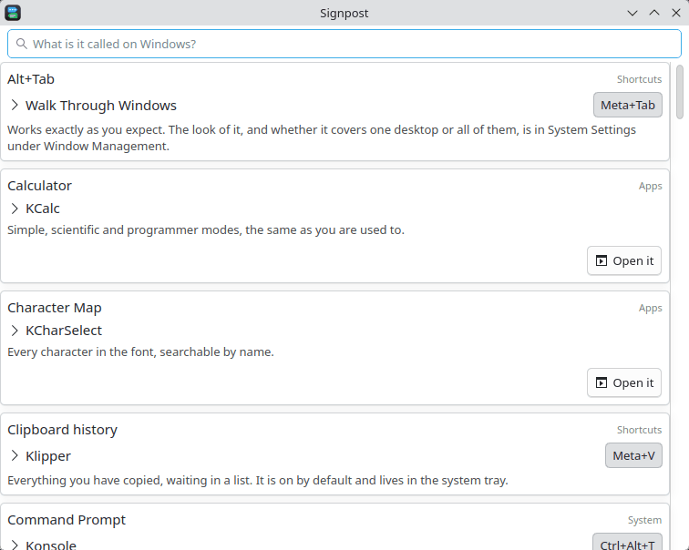
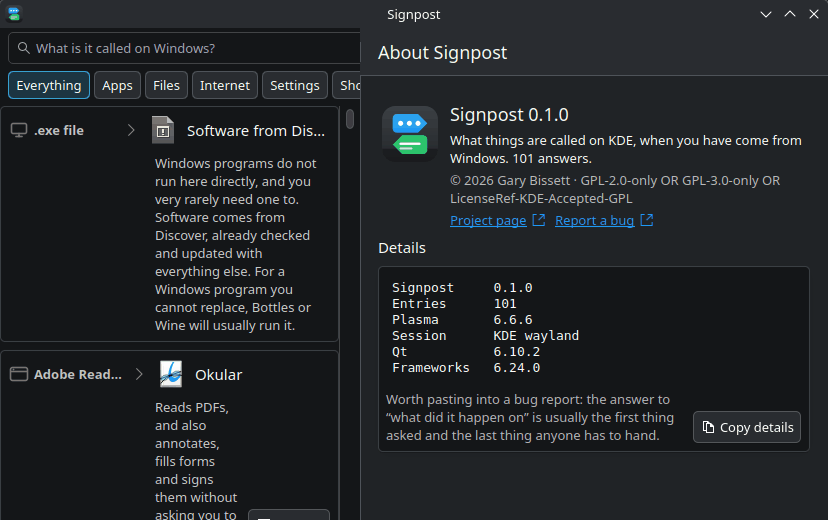

<!--
SPDX-FileCopyrightText: 2026 Gary Bissett <gary.bissett@gmail.com>

SPDX-License-Identifier: GPL-2.0-only OR GPL-3.0-only OR LicenseRef-KDE-Accepted-GPL
-->
<h1>
  <picture>
    <source media="(prefers-color-scheme: dark)" srcset="icons/64-apps-io.github.sonicp3l1c4n.signpost.svg">
    
  </picture>
  Signpost
</h1>


**What things are called on KDE, when you have come from Windows.**

Type the word you already know — `Task Manager`, `Control Panel`, `Win+E` — and
Signpost tells you what it is here, what the shortcut is on *this* machine, and
opens it for you.



It is for the week after the switch. The install went fine, the files came
across, the welcome tour has been dismissed, and now every third thing you want
to do begins with not knowing what it is called.

## Why an application and not a wiki page

Two reasons, and they are the whole design.

**It opens the thing.** A table of equivalents tells you that Task Manager is
System Monitor and leaves you to go and find it. Signpost has a button.

**It reads your machine rather than quoting a document.** Shortcuts are
configurable, and distributions change the defaults, so a phrasebook that prints
`Meta+E` from a data file is one distribution decision away from lying. Signpost
looks the binding up when it loads: `X-KDE-Shortcuts` from the
`kglobalaccel/*.desktop` files for launch shortcuts, and `kglobalshortcutsrc` for
what you have since changed and for KWin's own actions. If you have rebound
Overview to something else, that is what it shows you.

The same goes for the answer itself: an entry whose application is not installed
says so, and offers Discover instead of pretending.



## Status

Early, but it runs: 101 entries, scored search, category filters, live
shortcuts, application icons and the two buttons. The dataset is still the part
that needs the most work — see below.



## About the icons

Every card reads left to right: a grey mark for the thing you came in knowing,
then the real icon of the application that answers it. Half of "where is it" is
knowing what to look for once you are in the launcher, and a name on its own
does not tell you that.

The grey marks are **ours**, drawn for this project and deliberately generic —
one per category, not one per product. Microsoft's icons are Microsoft's:
shipping them would be a copyright and trademark problem for anyone
redistributing this, and would rule the application out of KDE. So the rule for
contributors is short: **never add Microsoft artwork, logos or screenshots**, no
matter how much better the card would look. If a card needs a stronger mark than
the category gives it, draw one.

## In KRunner

The phrasebook is also a KRunner plugin, which is the form the answer really
wants to take. Someone who has just switched presses Meta and types, because
that is what the Start menu trained them to do — and what they type is the
Windows word. Meeting them there costs nothing: no window to find, no
application to remember having installed.

Press Meta (or Alt+Space), type `task manager`, and **System Monitor** is in the
list with `Task Manager on Windows · Meta+Esc` underneath it. Enter starts it.
For an answer with nothing to launch — the registry, the Recycle Bin, OneDrive —
Enter opens Signpost on the explanation instead, because there the explanation
*is* the answer.

The plugin is deliberately quiet. KRunner belongs to every runner at once, so
only a Windows name or one of its aliases earns a row there; a summary that
merely mentions the word does not, and queries under three letters are ignored.
Both halves of that are covered by tests, because manners are the kind of thing
that regress silently.

`libkf6runner-dev` is optional at build time: without it you lose the plugin,
not the program. Installed under a user prefix, KRunner needs to be told where
to look —

```
QT_PLUGIN_PATH="$HOME/.local/lib/x86_64-linux-gnu/qt6/plugins" krunner --replace
```

— or install the plugin system-wide, where it needs no telling.

## Packaging

`io.github.sonicp3l1c4n.signpost.metainfo.xml` is installed alongside the menu
entry, so the application appears in Discover and in any other software centre —
which is where the people this is written for will look, since a Windows switcher
in their first week is not going to run `cmake`. It is validated by the test
suite rather than at packaging time.

`flatpak/` holds a manifest, with a caveat worth stating plainly: **Signpost is
an awkward fit for a sandbox.** Its whole job is answering questions about the
machine it is running on — what is installed, what the shortcuts are bound to —
and then opening what it named. All three are host questions. The manifest
therefore reads the host's application and shortcut configuration read-only, and
leaves the KRunner plugin out entirely, because nothing outside a sandbox can
load a plugin from inside one. Starting a host application needs
`--talk-name=org.freedesktop.Flatpak`, which is a broad permission.

It has been built and run. Getting there took three fixes that no amount of
reading would have produced:

- **`XDG_DATA_DIRS`**. `--filesystem=host-os` mounts the host's `/usr` and
  nothing looks in it, so the sandbox saw the runtime's fourteen desktop files
  instead of the host's two hundred and seventy-seven.
- **A menu definition.** `KService` does not read those directories; it reads
  KSycoca, which is built from an XDG menu file. The sandbox has none and the
  host's is not exposed, so the database came out empty — every answer claiming
  its application was missing, with total confidence.
- **The application's own id**, which was `org.kde.signpost` everywhere because
  `KAboutData` overwrites what `QGuiApplication` was told.

With those, `signpost --check` inside the sandbox reports **63 of 72**
applications resolved, against **68 of 72** on the host. The gap is
snap-packaged applications — Firefox and Thunderbird here — which live outside
everything a sandbox can be granted without dismantling it.

Which is the honest summary: the Flatpak works, and it is still the second-best
way to install this. A distribution package sees the whole machine, ships the
KRunner plugin, and needs no permissions at all.

## Version and About

The header carries the running version, and the menu beside it opens **About
Signpost** — which holds a Details block: the version, how many entries loaded,
Plasma, the session, Qt and Frameworks, behind a button that copies the lot.



The entry count is in there deliberately. It is the one number that says whether
the dataset loaded at all, which is exactly what a report about a missing answer
needs and exactly what the person reporting it cannot know to mention.

## Using it

```
signpost                  # the whole phrasebook, alphabetically
signpost "task manager"   # straight to the answer
signpost --check          # what this copy can see, and exit
```

`--check` exists because packaging turns "does it work" into a question you
cannot answer by looking. A sandboxed or badly installed copy opens its window
quite happily and is blind to the machine it is describing; this reports the
versions, the entry count and how many answers resolved to an installed
application, with no display needed.

Installed, it also answers to **Meta+/** — shipped as a `kglobalaccel` entry,
which is the same mechanism Signpost reads to tell you what Win+E became, so it
now answers for itself as well. The binding takes effect at your next login, and
System Settings → Shortcuts will change it like any other.

The second form is the one worth putting on a key of your own while you are
still learning your way around.

## Building

Kubuntu/Debian:

```
sudo apt install build-essential cmake ninja-build extra-cmake-modules \
    qt6-base-dev qt6-declarative-dev libkirigami-dev kirigami-addons-dev \
    libkf6coreaddons-dev libkf6i18n-dev libkf6config-dev libkf6service-dev \
    libkf6kio-dev libkf6runner-dev gettext

cmake -B build -G Ninja
cmake --build build
ctest --test-dir build --output-on-failure
./build/bin/signpost
```

To install it for yourself, with no root and nothing to undo later than
`build/install_manifest.txt`:

```
cmake -B build -G Ninja -DCMAKE_INSTALL_PREFIX="$HOME/.local"
cmake --build build
cmake --install build
kbuildsycoca6            # so the launcher and KRunner notice it
```

The binary lands in `~/.local/bin`, the menu entry and icons under
`~/.local/share`. Installed is not the same as built: the application claims its
desktop id only when the `.desktop` file is really there, so the portal has
something to resolve.

## The dataset

`data/entries.json`, compiled into the binary. One entry looks like this:

```json
{
  "id": "task-manager",
  "windows": "Task Manager",
  "aliases": ["taskmgr", "Ctrl+Shift+Esc", "end task"],
  "kde": "System Monitor",
  "summary": "The same job with more of it: processes, CPU, memory...",
  "category": "System",
  "desktop": "org.kde.plasma-systemmonitor.desktop"
}
```

`desktop` is what the Open button starts, where the launch shortcut is looked
up, and where the card's icon comes from. It takes a **list** as well as a
single id, because the same application is packaged differently on different
systems — Firefox is `firefox.desktop` here, `firefox_firefox.desktop` on a
snap, `org.mozilla.firefox.desktop` on a Flatpak — and the first one that is
actually installed wins:

```json
"desktop": ["firefox.desktop", "firefox_firefox.desktop", "org.mozilla.firefox.desktop"]
```

For a thing with no application behind it, `action` names a
`kglobalshortcutsrc` entry instead — `{"component": "kwin", "name": "Show
Desktop"}` — `icon` names a theme icon, since every card shows one, and
`shortcutDesktop` covers the few whose shortcut is defined under a different id
from the one that launches.

Some of those ship no launch shortcut at all: what you press for Win+P is
kscreen's Switch Display action, in a `[Desktop Action ShowOSD]` group of its
own, and kscreen has nothing bound for starting it. `shortcutAction` names the
action alongside `shortcutDesktop` — `"shortcutAction": "ShowOSD"` — because
guessing which of an application's actions the card meant is how a chip ends up
answering a question nobody asked.

Three rules for a new entry:

1. **Use the Windows word.** The entry is found by what the reader already
   calls it, so `aliases` should carry the wrong-but-common names too:
   `regedit`, `netplwiz`, `my computer`, the chord they used to press.
2. **Check the `.desktop` id exists** before adding it. A wrong id makes the
   entry look uninstalled forever.
3. **Say when the answer is "there isn't one".** OneDrive has no client;
   there is no registry; no antivirus is shipped. A phrasebook that invents an
   equivalent to avoid an awkward answer is worse than no phrasebook.

Entries are written from scratch rather than copied — a list of facts we
compose ourselves, so the dataset carries the project's own licence rather
than inheriting one.

## Licence

GPL-2.0-only OR GPL-3.0-only OR LicenseRef-KDE-Accepted-GPL, which is KDE's
preferred expression for application code — the project is written to be
proposable upstream. REUSE-compliant; every file says so itself.
